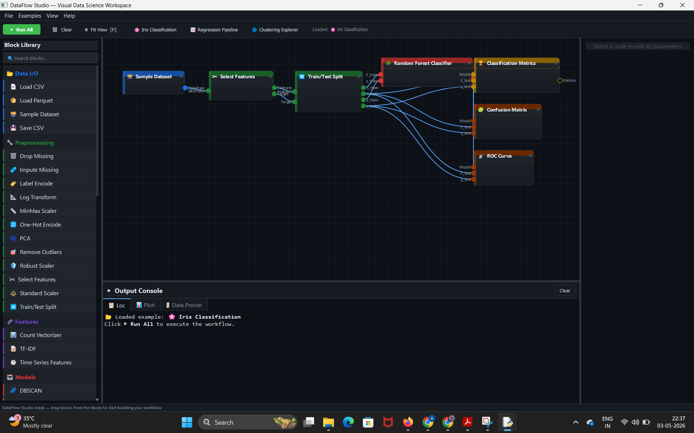

# 🌊 DataFlow Studio


**DataFlow Studio** is a lightweight, local-first visual programming environment for data science and machine learning. 

It abstracts complex `pandas` and `scikit-learn` scripts into an intuitive, drag-and-drop node interface. Build pipelines, clean data, train models, and visualize results instantly without writing a single line of boilerplate code.

 


## ✨ Features

- **No-Code Visual Workspace:** Drag, drop, and connect nodes to orchestrate complex machine learning pipelines.
- **Topological Execution Engine:** Automatically determines the correct order of operations; data flows seamlessly from left to right.
- **Real-Time Visualizations:** Auto-generated `matplotlib` charts (Scatter Plots, Heatmaps, ROC Curves, Residuals) directly inside the UI.
- **Advanced Machine Learning:** Includes Scikit-Learn's core classification, regression, and clustering algorithms, plus Deep Learning (MLP), Ensembling (Voting Classifiers), and automated Hyperparameter Tuning (Grid Search).
- **Save & Load:** Serialize your entire workspace into a lightweight JSON file to pick up exactly where you left off.
- **Zero Cloud Dependency:** Runs entirely locally on your machine. Your data never leaves your hard drive.

## 🚀 Quick Start

### Prerequisites
Ensure you have Python 3.8+ installed. 

### Installation
1. Clone the repository:
   ```bash
   git clone [https://github.com/yourusername/dataflow-studio.git](https://github.com/yourusername/dataflow-studio.git)
   cd dataflow-studio
   ```

2. Install the required dependencies:
   ```bash
   pip install -r requirements.txt
   ```

3. Launch the application:
   ```bash
   python main.py 
   ``` 
   *(Note: change `main.py` if you named your script something else)*

### Building Your First Pipeline
1. **Load Data:** Drag a **Sample Dataset** or **Load CSV** block from the left library onto the canvas.
2. **Preprocess:** Connect the `DataFrame` output to a **Train/Test Split** block.
3. **Train:** Drag a **Random Forest Classifier** onto the canvas and connect the `X_train` and `y_train` ports.
4. **Evaluate:** Connect the model and test data to a **Classification Metrics** block.
5. **Execute:** Click **▶ Run All** in the top toolbar and view your accuracy in the Output Console!

## 🧩 Available Nodes

DataFlow Studio includes a comprehensive library of nodes categorized by the data science lifecycle:

- **📂 Data I/O:** Load CSV, Load Parquet, Save CSV, Sample Datasets.
- **🔧 Preprocessing:** Drop/Impute Missing, Scalers (Standard, MinMax, Robust), Encoders (One-Hot, Label), Outlier Removal, Train/Test Split, PCA.
- **🧬 Features:** TF-IDF, Count Vectorizer, Time Series extraction.
- **🤖 Models:** Random Forest, Gradient Boosting, SVM, KNN, Logistic/Linear Regression, K-Means, DBSCAN, Isolation Forest.
- **🧠 Deep Learning:** Multi-Layer Perceptron (MLP) Classifier.
- **⚙️ Advanced:** Grid Search CV, Voting Classifier.
- **📊 Evaluation:** Regression/Classification Metrics, Cross Validation, Feature Importance.
- **📈 Visualization:** Histograms, Scatter Plots, Correlation Heatmaps, Confusion Matrices, Box Plots.

## 🗺️ Roadmap
Currently, DataFlow Studio is contained within a single file for rapid prototyping. The immediate roadmap includes:
- [ ] Refactoring the architecture into a modular Python package.
- [ ] Implementing a dynamic Plugin Registry so users can easily script custom blocks.
- [ ] Adding an "Export to Python" node to convert visual pipelines into runnable `.py` scripts.

## 🤝 Contributing
Contributions, issues, and feature requests are welcome! Feel free to check the issues page if you want to contribute.

## 📄 License
This project is licensed under the MIT License.
